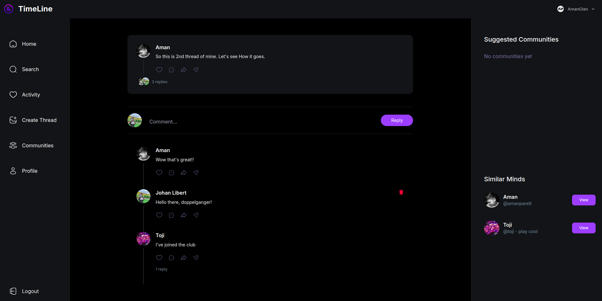
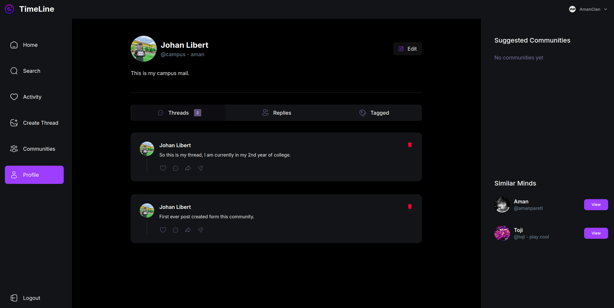

# TimeLine 🔥

## Your Next-Gen Thread Space! 🚀
Hey there! Timeline is where your thoughts come alive - think Threads, but cooler! Built with Next.js 15 and some awesome tech, it's your go-to spot for dropping hot takes, finding your tribe, and jumping into epic convos. No boring stuff, just pure social

## Features

- Authentication and webhook using Clerk
- Full CRUD operations for threads/posts
- Thread commenting system
- Responsive design with Tailwind CSS
- Form validation using Zod
- Community creation and management

## Technologies

- Next.js 15
- Clerk Authentication & Webhooks
- MongoDB & Mongoose
- Tailwind CSS
- React Hook Form
- Uploadthing
- TypeScript
- Zod Validation
- Shadcn UI

## Getting Started

1. Clone the repository
2. Install dependencies: `npm install`
3. Run the development server: `npm run dev`

## License

This project is licensed under the MIT License.
